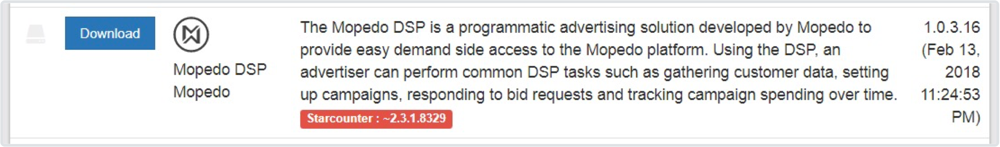

# Installation guide

It is easy to install and update instances of the [Mopedo DSP](../../), much thanks to how applications are distributed using the [Starcounter application platform](http://www.starcounter.com). This guide will assume that you have a working Windows Server VM instance running in Google Cloud, or some other cloud provider. For information about how to setup a Google Cloud instance, see the separate [Google Cloud Setup Guide](../Google%20Cloud%20setup%20guide) article.

## Installing a Mopedo DSP

### Installing Starcounter

The Mopedo DSP application is built on top of [Starcounter](http://www.starcounter.com), a high-performance in-memory database and app platform. To install a Mopedo DSP on a computer, we first need to install Starcounter.

1. Download the latest Starcounter version from [here](http://downloads.starcounter.com/download/Starcounter/Release/latest).
2. Run the Starcounter installer and choose **Production** on the first screen.

  If you have specified a separate database disk or want the DSP's database to be located at some location other than the user directory, make sure to select the **Change additional settings** option on the first screen of the installation wizard, and select that folder as the database repositories path (not the same as installation folder). If you have set up a blank database disk, create a folder called "Starcounter" on that disk and select that folder as database repositories path.

3. When the installation is complete, you will have two new icons on the desktop:

  - **Starcounter Personal Server**

    > This shortcut launches the Starcounter service. If the **administrator web page** cannot be reached, try right-clicking on this icon and choosing **Run as administrator**.

  - **Starcounter Personal Administrator**

    > This shortcut launches the Starcounter **administrator web page**, which is where we can create new databases, install apps and check application logs.

    Continue by clicking the **Starcounter Personal Administrator** icon. If the web page cannot be reached, right-click on the **Starcounter Personal Server** icon and click **Run as administrator**, and then click the **Starcounter Personal Administrator** icon again.

### Installing the Mopedo DSP

1. Create a new Starcounter database.

  All Starcounter applications run from inside a database. From the Starcounter Administrator web page, click the **Databases** tab in the top menu, and then **New database**.

2. Give your new database a fitting name and click **Create**.

3. Click the **App Warehouse** tab in the top view and scroll down until you see the Mopedo DSP in the list of apps:

  

4. Click **Download** to download and install the DSP application to the current database.

### Configuring the Mopedo DSP

1. Download the template [Mopedo.config](https://goo.gl/LdRLJ8) file, an XML text file that will contain the configuration for your Mopedo DSP, and place it in the `C:\Mopedo` directory (create the directory if it does not already exist).

2. Set the properties of the Mopedo.config file. See the [configuration](../Configuration%20guide) section for more information.

If the server will run more than one DSP application instance, you will need multiple databases – one for each DSP. To specify multiple configuration files, create one subfolder in `C:\Mopedo` for each database – with the same name as database – and place your configuration files inside the respective folder. Example: `C:\Mopedo\mydatabase\Mopedo.config`.

If you want to make changes to the configuration file while the app is running, you must stop and start the app again before changes are applied.

### Starting and stopping a Mopedo DSP

1. Start the Mopedo DSP by clicking on the **Start** button on the Mopedo DSP row in the database home window. To stop, press the **Stop** button.
2. If you want the Mopedo DSP to start automatically when the database starts, click the **Auto-Start** button.

### Updating a Mopedo DSP

1. To update a Mopedo DSP to a newer version, go to the **App Warehouse** for the database that the DSP is running from, find the Mopedo DSP with the latest version number, and click the **Upgrade** button.

2. The latest version of the app can then be launched from the database home window. If the app was already running, it will start automatically.

### Updating Starcounter

Some updates to the Mopedo DSP requires you to also update your Starcounter version. The Warehouse page will by default only show versions compatible with your current version of Starcounter. If you need to update, but cannot see the new version, it's likely that you need to update Starcounter before you can continue. You can check if there are incompatible versions of the Mopedo DSP by unchecking the **Show Compatible** checkbox at the top of the Warehouse page and scrolling down to the Mopedo DSP versions.

1. Download the latest Starcounter version [here](http://downloads.starcounter.com/download/Starcounter/Release/latest).
2. Double-click on the downloaded setup file and follow the instructions.
3. When setup is complete, click on the **Starcounter Personal Server** icon on your desktop to start the Starcounter service.
4. Update the Mopedo DSP.
